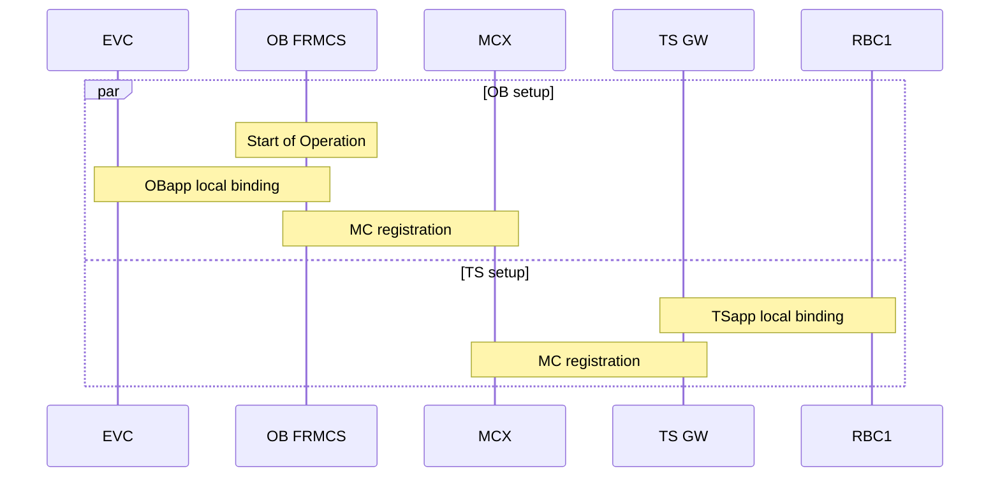
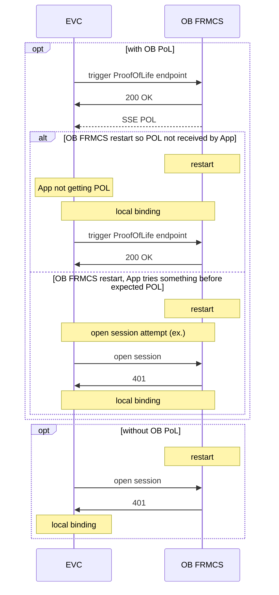
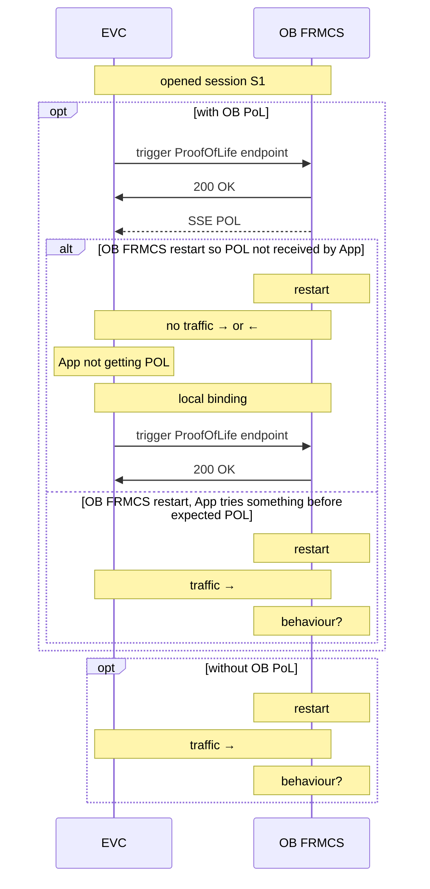
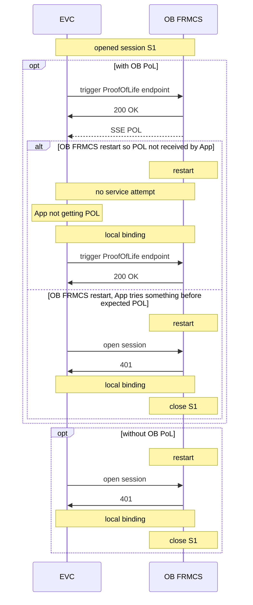
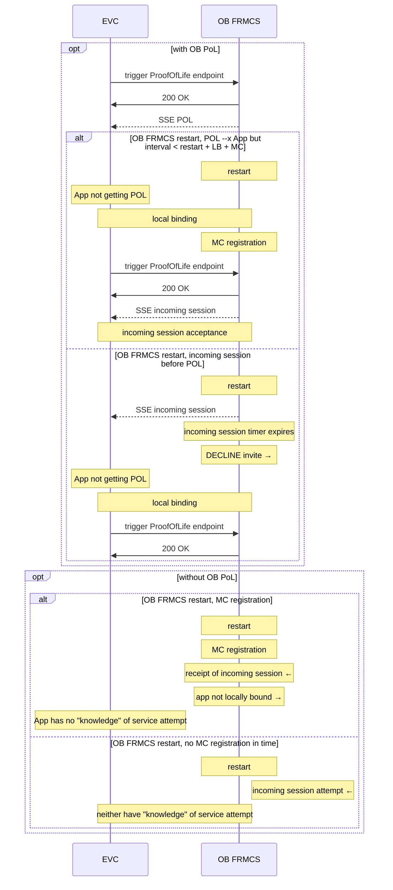
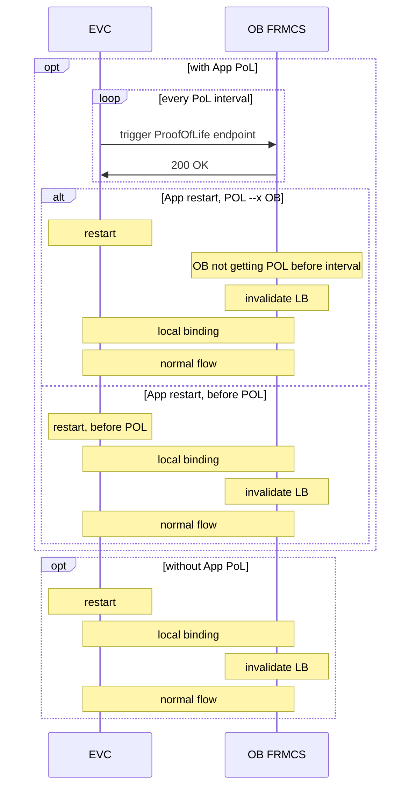
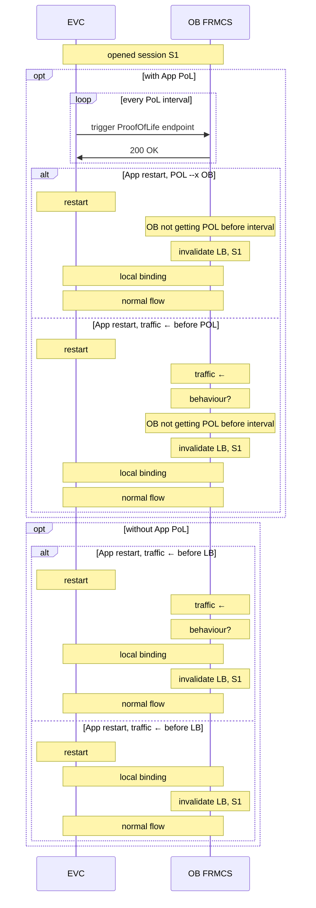
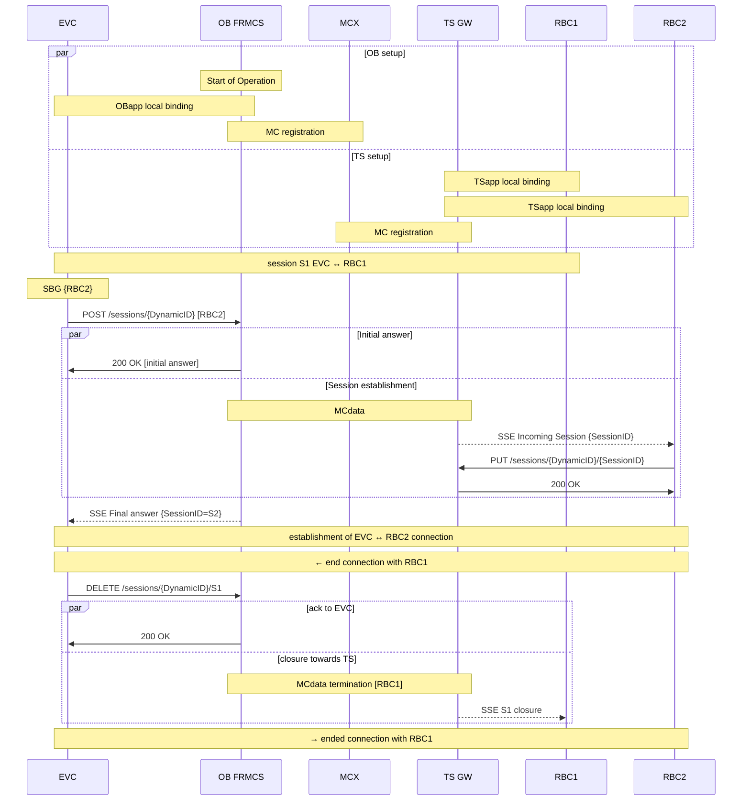

# Introduction

Some applications are foreseen to require some form of "proof of life" from the OB FRMCS and possibly vice-versa.
The present document investigates some of the scenarios.

# OB FRMCS restart

## Pre-condition workflow

## OFr.a Application has not initiated a session prior

## OFr.b Application has initiated a session prior

### OFr.b.1 Application does some network traffic on S1

### OFr.b.2 Application tries to open a new session S2

## OFr.c Application profile allows incoming session

# App restart

## Pre-condition workflow

## APPr.a Application had not initiated a session prior

## APPr.b Application had initiated a session prior

## APPr.c Application profile allows incoming session

