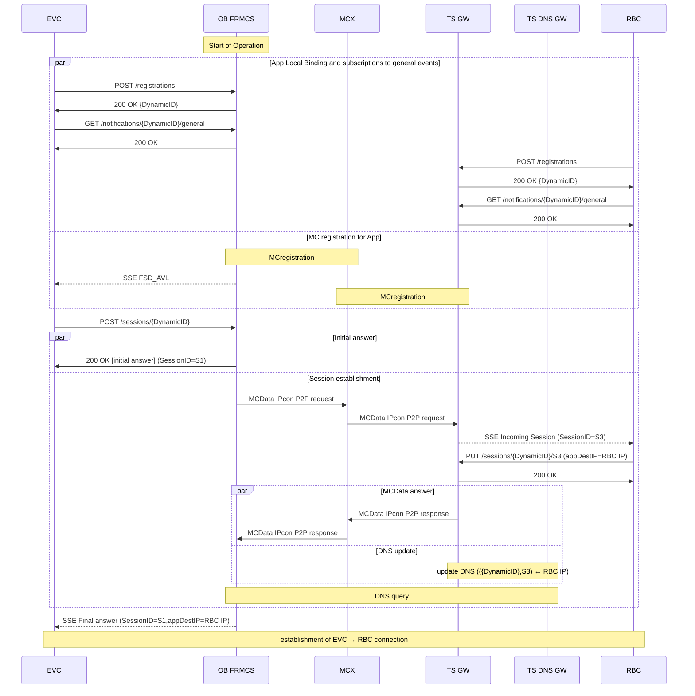

# Introduction

The present page provides some experimental contents pertaining with exposing the IP of the trackside application end point to the Onboard application.

# ETCS flow

## connection to RBC

