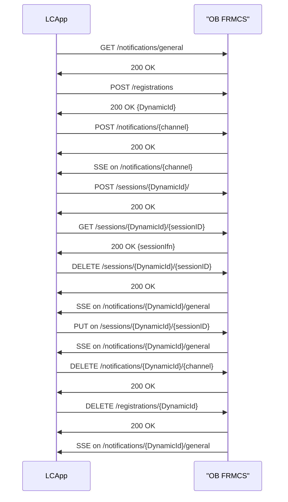
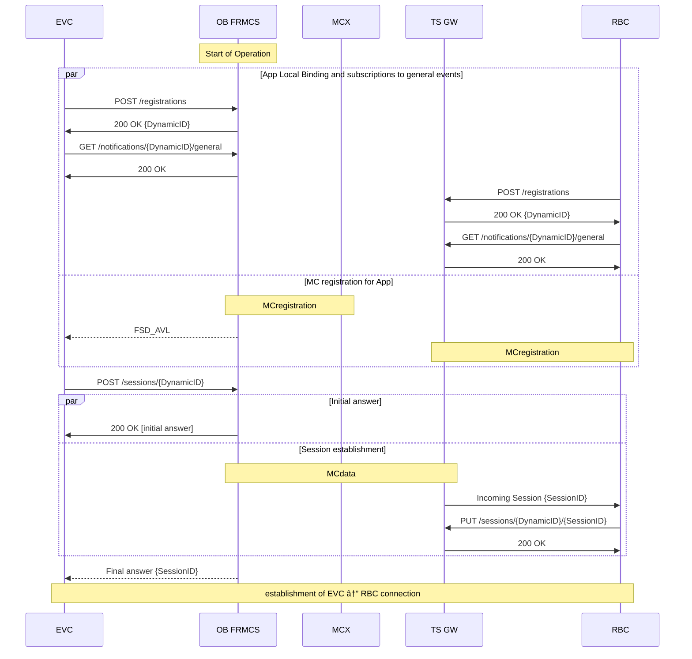

# Introduction

The present page provides some informational contents on usage of the OBapp / TSapp API in call flows

# Canonical call flow

```mermaid

sequenceDiagram
participant A as LCApp
participant B as "OB FRMCS"

	A->>B: GET /notifications/general
	B->>A: 200 OK
	
	A->>B: POST /registrations
	B->>A: 200 OK {DynamicId}

	A->>B: POST /notifications/{channel}
	B->>A: 200 OK
	% could also envisage GET /notifications/{DynamicId}/{channel}
	
	B->>A: SSE on /notifications/{channel}
	% potentially SSE on /notifications/{DynamicId}/{channel}
	
	A->>B: POST /sessions/{DynamicId}/
	B->>A: 200 OK
	% final answer could be SSE on /notifications/{OBappId}/general
	
	A->>B: GET /sessions/{DynamicId}/{sessionID}
	B->>A: 200 OK {sessionIfn}

	A->>B: DELETE /sessions/{DynamicId}/{sessionID}
	B->>A: 200 OK

	B->>A: SSE on /notifications/{DynamicId}/general
	A->>B: PUT on /sessions/{DynamicId}/{sessionID}

	B->>A: SSE on /notifications/{DynamicId}/general
	
	A->>B: DELETE /notifications/{DynamicId}/{channel}
	B->>A: 200 OK

	A->>B: DELETE /registrations/{DynamicId}
	B->>A: 200 OK

	B->>A: SSE on /notifications/{DynamicId}/general

```

# ETCS flow

```mermaid

sequenceDiagram
participant A as EVC
participant O as OB FRMCS
participant M as MCX
participant T as TS GW
participant B as RBC

Note over O: Start of Operation
par App Local Binding and subscriptions to general events
	%Note over LCAppOB,OBfrmcs: OBapp local binding
	A->>O: POST /registrations
	O->>A: 200 OK {DynamicID}
	A->>O: GET /notifications/{DynamicID}/general
	O->>A: 200 OK
	B->>T: POST /registrations
	T->>B: 200 OK {DynamicID}
	B->>T: GET /notifications/{DynamicID}/general
	T->>B: 200 OK
and MC registration for App
	Note over O,M: MCregistration
	O-->>A: FSD_AVL
	Note over T,B: MCregistration
end

%open session
A->>O:	POST /sessions/{DynamicID}
par Initial answer
	O->>A:	200 OK [initial answer]
and Session establishment
	Note over O,T: MCdata
	T->>B:	Incoming Session {SessionID}
	B->>T:	PUT /sessions/{DynamicID}/{SessionID}
	T->>B: 200 OK
end
O-->>A:	Final answer {SessionID}	
Note over A,B: establishment of EVC ↔ RBC connection


```
