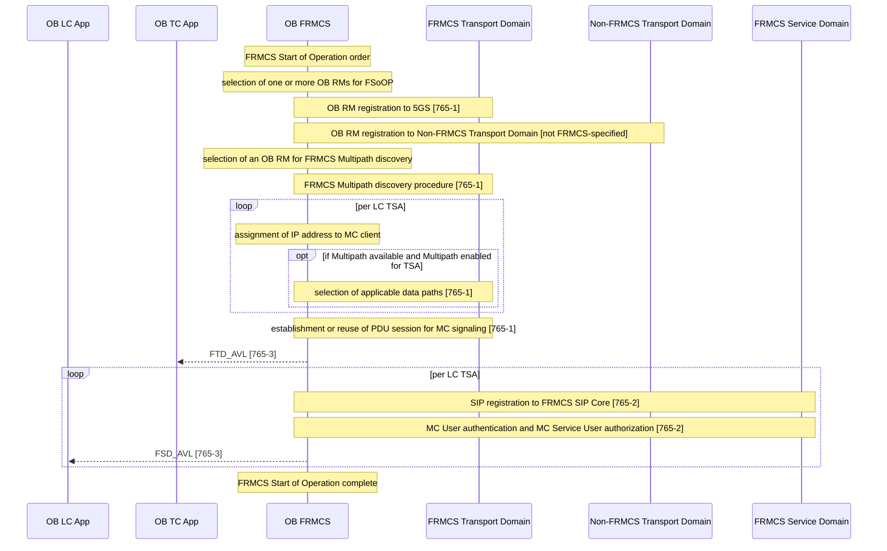
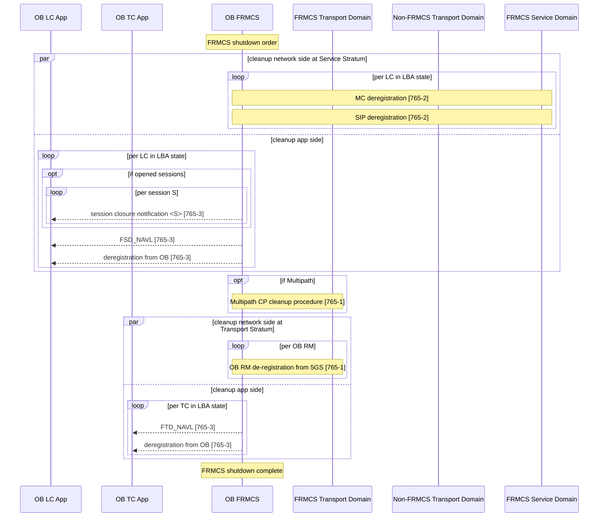

# Introduction

The present folder serves as a repository to collaborate on call flows pertaining to E2E Procedures.

# Start of Operation

```mermaid

sequenceDiagram
participant AL as OB LC App
participant AT as OB TC App
participant O as OB FRMCS
participant FTD as FRMCS Transport Domain
participant NFTD as Non-FRMCS Transport Domain
participant FSD as FRMCS Service Domain

Note over O: FRMCS Start of Operation order

Note over O: selection of one or more OB RMs for FSoOP
Note over O, FTD: OB RM registration to 5GS [765-1]
Note over O, NFTD: OB RM registration to Non-FRMCS Transport Domain [not FRMCS-specified]

Note over O: selection of an OB RM for FRMCS Multipath discovery
Note over O, FTD: FRMCS Multipath discovery procedure [765-1]

loop per LC TSA
  Note over O: assignment of IP address to MC client
  opt if Multipath available and Multipath enabled for TSA
    Note over O, FTD: selection of applicable data paths [765-1]
  end
end

Note over O, FTD: establishment or reuse of PDU session for MC signaling [765-1]
O -->> AT:  FTD_AVL  [765-3]

loop per LC TSA
  Note over O, FSD: SIP registration to FRMCS SIP Core [765-2]
  Note over O, FSD: MC User authentication and MC Service User authorization [765-2]
  O -->> AL:  FSD_AVL [765-3]
end

Note over O: FRMCS Start of Operation complete
```

# Close of Operation

```mermaid

sequenceDiagram
participant AL as OB LC App
participant AT as OB TC App
participant O as OB FRMCS
participant FTD as FRMCS Transport Domain
participant NFTD as Non-FRMCS Transport Domain
participant FSD as FRMCS Service Domain

Note over O: FRMCS shutdown order

par cleanup network side at Service Stratum
  loop per LC in LBA state
    Note over O,FSD:  MC deregistration [765-2]
    Note over O,FSD:  SIP deregistration [765-2]
  end
and cleanup app side
  loop per LC in LBA state
    opt if opened sessions
      loop per session S
        O -->>AL:  session closure notification <S> [765-3]
      end
    end
    O-->>AL:  FSD_NAVL [765-3]
    O-->>AL:  deregistration from OB [765-3]
  end
end

opt if Multipath
  Note over O,FTD: Multipath CP cleanup procedure [765-1]
end

par cleanup network side at Transport Stratum
  loop per OB RM
    Note over O,FTD: OB RM de-registration from 5GS [765-1]
  end
and cleanup app side
  loop per TC in LBA state
    O-->>AT:  FTD_NAVL [765-3]
    O-->>AT:  deregistration from OB [765-3]
  end
end 

Note over O: FRMCS shutdown complete
```
